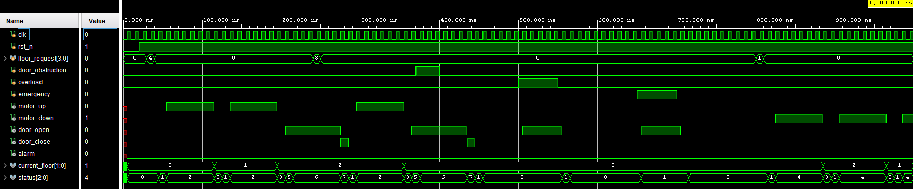

# Elevator Controller FSM (Verilog)

## Overview

This project implements a 4-floor Elevator Controller using a Finite State Machine (FSM) in Verilog HDL. The controller manages floor requests, elevator movement, door operation, and safety conditions such as overload and emergency situations.

The design was developed and verified using Vivado behavioral simulation.

---

## Features

- 4-floor elevator system
- Floor request registration and servicing
- Upward and downward movement control
- Door open, wait, and close sequence
- Door obstruction handling
- Overload detection and protection
- Emergency mode operation
- Timer-based movement and door delays
- FSM-based control architecture

---

## FSM States

| State | Description |
|---|---|
| `LIFT_IDLE` | Waiting for floor requests |
| `CHECK_REQUEST` | Determines next action based on pending requests |
| `MOVE_UP` | Elevator moving upward |
| `MOVE_DOWN` | Elevator moving downward |
| `ARRIVED` | Elevator has reached a floor |
| `DOOR_OPEN` | Door opening sequence |
| `DOOR_WAIT` | Door remains open for passengers |
| `DOOR_CLOSE` | Door closing sequence |
| `OVERLOAD` | Elevator overloaded; movement disabled |
| `EMERGENCY` | Emergency condition activated |

---

## Inputs

| Signal | Description |
|---|---|
| `clk` | System clock |
| `rst_n` | Active-low reset |
| `floor_request[3:0]` | Floor request buttons |
| `door_obstruction` | Indicates door blockage |
| `overload` | Overload detection signal |
| `emergency` | Emergency activation signal |

---

## Outputs

| Signal | Description |
|---|---|
| `motor_up` | Controls upward movement |
| `motor_down` | Controls downward movement |
| `door_open` | Opens elevator door |
| `door_close` | Closes elevator door |
| `alarm` | Alarm indicator |
| `current_floor[1:0]` | Current elevator floor |
| `status[2:0]` | Encoded FSM state output |

---

## Simulation

The design was verified using a Verilog testbench in Vivado behavioral simulation.

The testbench covers:

- Reset operation
- Floor request handling
- Upward elevator movement
- Downward elevator movement
- Door open and close sequence
- Door obstruction condition
- Overload condition
- Emergency condition

Simulation waveform:

---

## Repository Files

| File                                  | Description                                              |
| ------------------------------------- | -------------------------------------------------------- |
| `README.md`                           | Project documentation                                    |
| `elevator_controller.v`               | RTL design of the elevator controller                    |
| `elevator_controller_tb.v`            | Verilog testbench used for behavioral simulation         |
| `elevator_controller_tb_waveform.wdb` | Vivado waveform database file generated after simulation |
| `waveform.png`                        | Simulation waveform screenshot                           |

## Tools Used

- Verilog HDL
- Xilinx Vivado
- Behavioral Simulation

---

## Future Improvements

- FPGA implementation on a development board
- Seven-segment display interface for floor indication
- Better request priority scheduling
- Multi-elevator control logic
- Additional safety and fault-handling features

---

## Project Status

The RTL design has been functionally verified using behavioral simulation. Synthesis and FPGA implementation can be added in future work.
